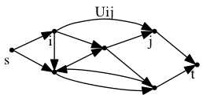
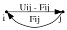
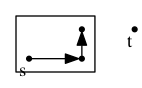

Lecture 2 (Thursday 4 September), Ryan Ordille

# Network Flows

A good is produced at a vertex $s$ and we want to transport as much of it as possible to a vertex $t$. The difficulty is that each line (arc $a = (i,j)$) has a capacity $u_{ij}$ stating the maximum amount of the good that can be sent through the arc in a fixed time period.

<!-- graph G -->

Usage examples:

* sending oil through pipelines
* current in electrical networks
* data packets in an information network
* goods in a transportation network
* currency in a financial market
* other "strange" applications (more on this later)

Formally, given a directed graph $G = (V, A)$, an **s-t flow** $f$ has two properties:

* Capacity constraints - $0 \leq f\_{ij} \leq u\_{ij}$
* Flow conservation - $flow\_{in} (v) = flow\_{out} (v) \; \forall v \neq s, t$ (only $s$ and $t$ can violate this)

$$ \sum\_{x : (x,v) \in A} f\_{xv} = \sum\_{y: (v,y) \in A} f\_{vy} $$

The **value** $\left|f\right|$ of a flow is the amount of the good sent from $s$ to $t$.

$$ flow\_{out} (s) = \sum\_{x:(s,x) \in A} f\_{sx} = \left|f\right| = flow\_{in} (t) = \sum\_{y:(y,t) \in A} f\_{yt} $$

We may assume that there are no arcs into $s$ or out of $t$ as they are useless to us.

## Maximum Flow Problem

*Find an s-t flow $f^\prime$ of maximum value.*

Informally, we are trying to fit as many s-t paths into $G$ as possible. We can extend this later with lower bounds on arcs, multiple sources or sinks, etc.

### Ford-Fulkerson Algorithm

We can find a max-flow using the Ford-Fulkerson (FF) algorithm:

    F = 0
    Repeat:
        Find an augmenting path P w.r.t. F
        Augment flow on P by b(P)

### Residual Graph

The easiest way to find an augmenting path is by using **residual graphs**. Given $G$ and a flow vector $f$, the residual graph $G\_f$ is defined by:

<!-- residual graph def -->

For clarity's sake, ignore writing the branches if they are zero.

A path $P$ is **augmenting** with respect to $f$ in $G$ if and only if $P$ is a directed s-t path in $G\_f$.

The **bottleneck value** $b(P)$ is the minimum capacity of an arc of $P$ in $G\_f$.

### Example

<!-- page 3 example -->
<!-- TODO -->

At this point we are stuck. There are no directed paths in $G\_f$, thus there are no augmenting paths in $G$. We have an s-t cut $S$ with no arcs from $S$ to $\bar{s}$ in $G\_f$.

<!-- s-t cut -->

We can show that the algorithm works (i.e. finds the max flow) by using these s-t cuts (*certificate of optimality*).

## Minimum Cuts

### Lemma

***Lemma 1*** - take an s-t cut $(S, V-S)$ and a flow $f$. Then,

$$ \left|f\right| = \sum\_{a \in \delta^+ (S)} f\_a - \sum\_{a \in \delta^- (S)} f\_a $$

<!-- before-proof picture -->

#### Proof

$$ \left|f\right| =  \sum\_{a \in \delta^+ (\{s\})} f\_a -  \sum\_{a \in \delta^- (S)} f\_a $$

The term $ \sum\_{a \in \delta^- (S)} f\_a $ is zero by definition (as there is no flow into the starting vertex $s$).

$$ \left|f\right| = \left( \sum\_{a \in \delta^+ (\{s\})} f\_a -  \sum\_{a \in \delta^- (S)} f\_a  \right) + \sum\_{\forall v \in S - \{s\}} \left(  \sum\_{a \in \delta^+ (v)} f\_a -  \sum\_{a \in \delta^- (v)} f\_a \right) $$

The inside of the right sum, $\sum\_{a \in \delta^+ (v)} f\_a -  \sum\_{a \in \delta^- (v)} f\_a $, is zero for every $v$ by the principle of flow conservation. 

$$ \left|f\right| = \sum\_{v \in S} \left( \sum\_{a \in \delta^+ (v)} f\_a -  \sum\_{a \in \delta^- (v)} f\_a  \right) $$

$$ \left|f\right| = \sum\_{a \in \delta^+ (S)} f\_a -  \sum\_{a \in \delta^- (S)} f $$

### Corollary

Let $cap(s) =  \sum\_{a \in \delta^+ (S)} u\_a$ be the **capacity** of the s-t cut $S$. 

***Corollary 2*** - for any s-t flow $f$ and any s-t cut $S$, we have

$$ \left|f\right| \leq cap(s) $$

#### Proof

$$ \left|f\right| =  \sum\_{a \in \delta^+ (S)} f\_a  -  \sum\_{a \in \delta^- (S)} f\_a $$

By the capacity constraints:

$$ \left|f\right| \leq  \sum\_{a \in \delta^+ (S)} u\_a -  \sum\_{a \in \delta^ (S)} 0 \leq cap(s) $$

So the max s-t flow value is at most the minimum capacity of an s-t cut. In fact they are equal by the *Max Flow Min Cut Theorem*.

### Max Flow Min Cut Theorem

The value of a max-flow $|f^\prime|$ is equal to the value of the minimum capacity of the s-t cut $cap(S^\prime)$.

$$ |f^\prime| \geq cap(S^\prime) $$

More on this next lecture.