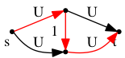
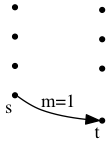
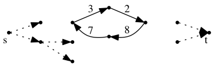
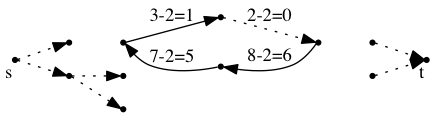
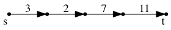
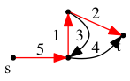

COMP 360 Fall 2014 - Ryan Ordille

# Lecture 4 - Thursday, 11 September

## Ford-Fulkerson & Pseudo-Polytime Algorithms

*Is FF a good algorithm?* Given $G=(V,A)$ with $|V| = n$, $|A| = m$, our inner loop has the following time constraints:

* find the residual graph $G\_{f}$ - $O(m)$
* find an s-t path in $G\_{f}$ via BFS, DFS, etc. - $O(m)$
* augment flow - $O(n)$.

How many iterations of the inner loop do we have? Can we find a crude upper bound?

Let $U$ be $max(i,j)$ $u\_{ij}$, then the minimum cut has capacity at least $m \cdot U$ (there are at most $m$ arcs in any cut). In fact, 

$$ cap(S^{*}) \leq cap(s) \leq n \cdot U $$

The bandwidth $b(P) \geq 1$ in each step. In the worst case, we send just one unit of flow per step, so there are at most $n \cdot U$ steps.

Thus, our run time is $O(m \cdot n \cdot U)$. 

This is a **pseudo-polynomial** algorithm, as it looks OK but can be extremely bad if $U$ is extremely large.  For a $k$-bit number, the size of $U$ can be up to $2^k$, so this algorithm is not polynomial in $k$.

We really want our algorithm to be polynomial in $k$, i.e. polynomial in $\log(U)$.

## FF Worst-Case Example

Choosing a bad augmenting path can be terrible for FF. In the following example, we keep sending one unit over the middle bottleneck (in red), taking us $2U$ iterations to find the max flow. With a smarter choice of an augmenting path, we can find the max flow in just two steps.

<!-- bad example -->

## Flow Decomposition Theorem

We can speed up the Ford-Fulkerson algorithm by investigating the structure of network flows.

***Flow Decomposition Theorem*** - any s-t flow $f$ can be decomposed into at most $M$ s-t paths and directed cycles.

### Proof (by induction)

If $m=1$, then $G$ has one arc from $s$ to $t$.

<!-- one arc -->

The flow is just over one s-t path $(s,t)$. Assume this for graphs with $m \leq m-1$ arcs. Now, try with $m$ arcs.

If the flow $f$ contains a directed cycle $C$ (showing all arcs with $f\_{ij} > 0$), we have a graph that looks like this:

<!-- digraph with cycle C -->

<!-- c surrounded by parens makes the copyright symbol even in math mode, so remember to escape that -->
Let $f(\text{c}) = \min\_{(i,j) \in C} f\_{ij}$ ($f(\text{c}) = 2$ in the above graph). Remove $f(\text{c})$ unites of flow from each arc in $C$.

<!-- with f c removed -->

This is still an s-t flow $f' = f - C\_{f(\text{c})}$. The capacity constraints and flow conservation principles still apply.

$f'$ has at most $m-1$ arcs with $f'\_{ij} > 0$, i.e. some arcs on $C$ has $f'\_{ij} = 0$. $f'$ decomposes into $m-1$ paths and cycles, so $f$ decomposes into $m$ paths and cycles. 

$$ f = f' + (C \text{ with } f(\text{c}) \text{ flow on it}) $$ 

So $|f| = |f'|  \; \square$. 

Suppose we can find an s-t path from $f$:

<!-- s-t path example -->

Let $f(P) = \min\_{(i,j) \in P} f\_{ij}$. Remove $P$ with weight $f(P)$ from $f$. In this example, $f(P) = 2$, so $f' = f - P \cdot f(P)$. $f'$ has $m-1$ arcs, so it decomposes into $m-1$ paths and cycles, so $f$ decomposes into $m$ paths and cycles.

### Uses

Why is this useful? 

FF finds at most $cap(S^{\*}) = C \leq n \cdot U$ paths. The Flow Decomposition Theorem says that the max flow $f^{\*}$ (or any $f$) can be found using at most $m$ paths. So if $m << C$, we can do much better. However, we need $f^{\*}$ to find the decomposition and the paths!

(note: we can ignore the cycles as they don't increase the flow value in $f^{\*}$.)

## Maximum Capacity Augmenting Path Algorithm

FF can augment on any average path. What if we choose the "best" average path (i.e. the one with the largest $b(P)$)?

    f = 0
    Repeat {
        Let P* be max capacity s-t path in Gf
        Augment flow by b(P*)
    }

**Can we find $P^{\*}$ efficiently?** Let $G\_f [k]$ be the subgraph of $G\_f$ with the $k$ highest capacity arcs. $cap(P^{\*})$ is the capacity of the last arc added. Keep greedily adding the arcs with the next highest $b(P)$ to $P^{\*}$ until an s-t path is found. 

<!-- graph showing the in-class example of this greedy algorithm -->

This takes $O(m \cdot \log(m) + 2m \cdot m) = O(m^2)$ time:

* $m \cdot \log(m)$ to sort the arcs in order of bandwidth and
* $2m \cdot m$ as to depth-first search to find an s-t path over = the worst case number of paths.

We can reduce the right part even further by using *bisection search*, giving us a $O(m \log m)$ running time to find the max capacity s-t path.

### Reducing iterations

Although finding $P^{\*}$ now takes $O(m \log m)$ time, augmenting still takes $O(n)$. Our inner loop hasn't gotten much better, but have we reduced the amount of iterations we need?

Suppose we have $f$ so far and are looking for $f^{\*}$. $f^{\*} - f = f'$, which is a flow! 

Observe that, by the Flow Decomposition Theorem, at any step there is a $P^{\*}$ with augmenting capacity at least

$$ \frac{|f^{\*}| - |f|}{m} $$

For example, at the start, there is a $P^{\*}$ with $b(P^{\*}) \geq \frac{|f^{\*}|}{m}$. $f^{\*} \rightarrow P\_1, \ldots, P\_m$, and $P^{\*}$ is at least as good as any of these.

In general, we can get a $\frac{1}{m}$ fraction of the remaining flow $|f^{\*}| - |f|$ needed. So each $P^{\*}$ we find in any steps gets us a $\frac{1}{m}$ fraction towards were we are going. So, after $k$ steps, 

$$ |f^{\*}| - |f| \leq \left(1 - \frac{1}{m} \right)^k |f^{\*}| $$

We are talking about integers, so we are always improving the flow by at least 1 every iteration. In other words, if $\left( 1 - \frac{1}{m} \right)^k |f^{\*}| < 1$, then we are done.

If we set $k=m \log |f^{\*}|$, then

$$ \left( 1 - \frac{1}{m} \right)^{m \log |f^{\*}|} < e^{- \log |f^{\*}|} = \frac{1}{|f^{\*}|} $$

So we are done in $m \log |f^{\*}|$ steps. $|f^{\*}| - C \leq n \cdot U$.

So the running time is at least $O(m \log m \cdot m \cdot \log(n \cdot U)) \approx O(m^2 \cdot \log U)$. This is ***(weakly) polynomial***, as it is a function of the bit size.

Next lecture, we will see how to get rid of the numbers altogether.